# Milano Agent

Milano Agent is an **AI-powered financial analysis assistant** specialized in the **Vietnamese stock market**.  
It leverages the **Advanced ReAct (Reasoning – Action – Reflection)** framework and is implemented with **Domain-Driven Design (DDD)** principles for scalability and maintainability.

----------

## 🚀 Key Features

-   **Vietnamese Stock Market Expertise** – tailored for HOSE, HNX, UPCoM.
-   **Advanced ReAct Workflow** – structured reasoning with transparency.
-   **Multi-Tool Orchestration** – price, fundamentals, industry, peer comparison, knowledge retrieval, and news.
    
-   **Trust & Transparency** – every step of the reasoning process is shown to the user.
    
-   **Risk Disclosure** – all answers include disclaimers.
    

----------

## 🧩 Workflow

The agent follows a **Reasoning–Action–Reflection** loop:

1.  **THOUGHT** – Analyze the query logically.
    
2.  **ACTION** – Call the most suitable tool(s).
    
3.  **OBSERVATION** – Collect and evaluate tool outputs.
    
4.  **REFLECTION** – Adjust strategy if needed.
    
5.  **FINAL ANSWER** – Provide a clear and reliable response.
    

<p align="center">  </p>

----------

## 🏛️ Domain-Driven Design Architecture

Milano Agent is structured using **DDD principles**, ensuring clear separation of concerns:

```bash
milano-agent/
│── src/
│   ├── domain/           # Core business logic (Entities, Value Objects, Aggregates)
│   │   ├── models/       # Domain models (Stock, Industry, AnalysisResult)
│   │   └── services/     # Domain services (ReAct workflow, Risk management)
│   │
│   ├── application/      # Use cases orchestrating domain logic
│   │   ├── agents/       # Milano Agent orchestration
│   │   └── handlers/     # Command/query handlers
│   │
│   ├── infrastructure/   # External integrations & technical details
│   │   ├── tools/        # Tool implementations (stock_price, rag_knowledge, etc.)
│   │   └── adapters/     # API clients, persistence, message brokers
│   │
│   └── interface/        # Entry points (CLI, API, UI)
│       └── controllers/  # Input/output handling
│
│── examples/             # Example queries and outputs
│── requirements.txt      # Dependencies
│── README.md             # Documentation
│── ...                   # All others base files

```

-   **Domain**: Encapsulates business knowledge (financial analysis logic, risk disclaimers).
    
-   **Application**: Coordinates domain logic for different user queries.
    
-   **Infrastructure**: Connects to external data sources and APIs.
    
-   **Interface**: Provides endpoints for users (CLI/API/UI).
    

----------
## 🏗️ System Architecture

The following diagram illustrates Milano Agent’s **system architecture**, including data flow, external integrations, and core modules:

<p align="center">  </p>

----------


## 🛠️ Tools

-   **`stock_price`** – Get real-time or historical stock prices.
    
-   **`rag_knowledge`** – Retrieve knowledge from internal knowledge base.
    
-   **`peers_comparison`** – Compare multiple stocks in the same industry.
    
-   **`fundamental_analysis`** – Core financial indicators (P/E, ROE, EPS, etc.).
    
-   **`chat_llm`** – General market Q&A.
    
-   **`tavily_search`** – News search from the web.
    
-   **`industry_analysis`** – Industry-level benchmarking.
    

----------

## 📖 Example Query

**User Query**: _"Phân tích cổ phiếu FPT"_

-   **THOUGHT**: Break into stock price, news, fundamentals, industry.
    
-   **ACTION**: Calls multiple tools in sequence.
    
-   **OBSERVATION**: Collects structured outputs.
    
-   **REFLECTION**: Adjusts if incomplete or inconsistent.
    
-   **FINAL ANSWER**: Provides insights + disclaimer.
    

----------

## ⚖️ Guardrails

-   Only predefined tools are allowed.
    
-   Always validate input format (symbols, dates).
    
-   Direct answers for greetings and casual chat.
    
-   **Always include disclaimer** in financial answers:
    

> "This information is for reference only and not investment advice. Investment decisions should be based on personal analysis and risk tolerance."


----------
